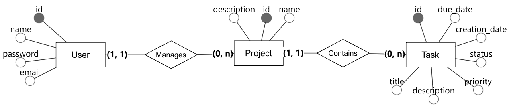

# Task Manager

 

## 🎯 Project Description

**Task Manager** is a Full Stack application designed to help users organize their daily activities through projects and tasks.

Each user can create projects and manage multiple tasks, keeping track of their progress using priorities, statuses, and due dates.

The main purpose of this project is to practice **backend development with Java**, focusing on Object-Oriented Programming, layered architecture, REST API development without frameworks, JDBC, database modeling, and MySQL integration.

The frontend was developed using **HTML, CSS, and JavaScript**, serving only as a client that consumes the backend API.

---

## 📋 Business Rules

- The system must allow users to register.
- Every user must have a name, email address, and password.
- The email address must be unique for each user.
- Users must be able to log in using their email and password.
- A user can update their personal information.
- A user can own one or more projects.
- Every project belongs to a single user.
- Every project must have a name.
- A project may have an optional description.
- A user cannot have two projects with the same name.
- A project can contain zero or many tasks.
- A project can be updated or deleted.
- A project cannot be deleted while it still contains tasks.
- Every task belongs to a single project.
- The system must allow creating, updating, listing, and deleting tasks.
- Every task must have a title.
- A task may have an optional description.
- Every task must have a priority.
- Every task must have a status.
- Every task must have a creation date, which is automatically generated by the system.
- A task may have a due date defined by the user.
- A task can have one of the following priorities: **Low**, **Medium**, or **High**.
- A task can have one of the following statuses: **Pending**, **In Progress**, or **Completed**.
- The system must allow changing a task's status.
- Two tasks within the same project cannot have the same title.
- Tasks with the same title are allowed in different projects.
- The system must allow searching tasks by title.
- The system must allow filtering tasks by priority.
- The system must allow filtering tasks by status.
- The system must allow sorting tasks by due date.
- All data must be validated before being stored in the database.

---

## 🗂 Conceptual Model

---

## 🗄 Logical Model

## 🛠 Technologies

### Backend

- Java
- JDBC
- Java HttpServer
- MySQL

### Frontend

- HTML5
- CSS3
- JavaScript

---

